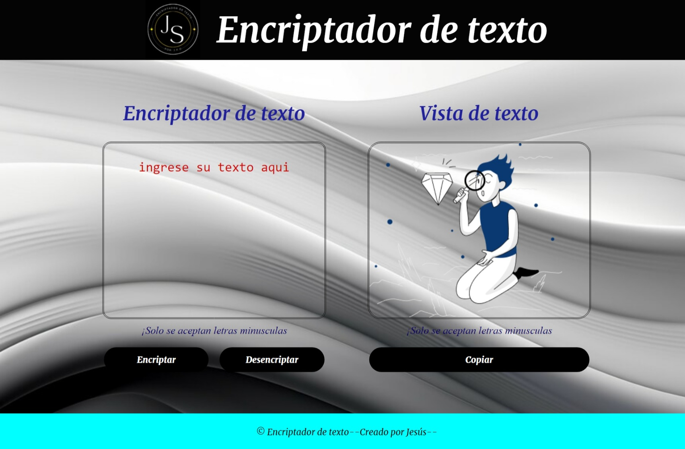

<h1>Encriptador de texto 📱 </h1>

<h2>Descripcion del proyecto</h2>

El proyecto consiste en el desarrollo de un encriptador y desencriptador de texto, diseñado como parte de un reto de programación propuesto por Alura Latam+Oracle One. El objetivo es crear un algoritmo eficiente que pueda cifrar y descifrar mensajes, utilizando técnicas de encriptación básicas.

<h2>Funcionalidades del proyecto</h2>

🔒`Cifrado de texto:`  Convierte el texto claro en texto cifrado.

🔐`Descifrado de texto:`Transforma el texto cifrado de vuelta a su forma original.

💿`Copiar texto:`Copia el texto generado para utilizarlo y no tenga modificaciones u alteraciones.

<h2>Nota 📑</h2>
Solo se puede utilizar el mismo encriptador para convertir el texto desencriptado o viseversa ya que su algoritmo esta diseñado para hacer funciones especificas.📝

<h2>Lenguajes utilizados</h2>

`Java Scrip - Html -CSS`

<h2>Atribuciones</h2>

Este es un proyecto echo con ayuda de cursos proporcionados por Alura latam y Oracle one,como parte de la formacion brindada en su programa: ONE - Oracle Next Education,
se usaron imagenes de freepik.com. 

`ALURA G7 – ONE | 2024`

`Freepik.com`

